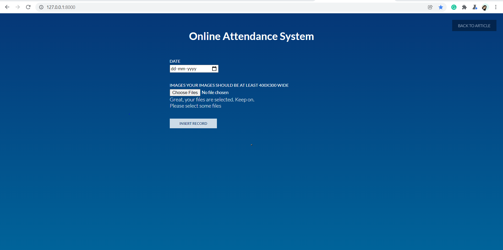

<<<<<<< HEAD
# Online Attendance System 
It is attendance system used to record students' attendance in online classes by recognising their face.

Models used are 
* MTCNN
* Facenet
* SVM Classsifier

Libraries used are:
* tensorflow
* keras
* sklearn
* matplotlib
* numpy
* PIL

For backend :
* Django 

For Frontend :
* HTMl , CSS

=======
# Online-Attendance-System
In this project, we tell the user to enter the image in which the faces of the students are visible, and the date for which the instructor wants to take the attendance.
With the help of the input data enter by the user, the model will update the information on the dummy excel sheet.Students whose faces will be detected, their present will be displayed in the sheet.

### After submitting the record, dataframe will be visible in the form of table.

### By clicking on "Show Record" button, it will open the record on the new tab, from there you can save the sheet in the form html, etc.

>>>>>>> manisha
